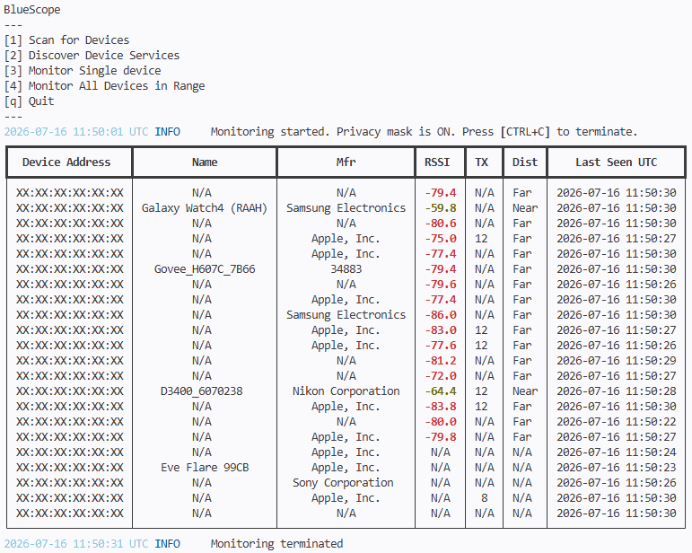

# BlueScope
**BlueScope** is an asynchronous, Bluetooth Low Energy (BLE) scanning, discovery, and live-telemetry terminal application built with Python `asyncio`, `Bleak`, and `Rich`.



## Features

* **Asynchronous Processing:** Powered by `asyncio` to handle non-blocking live terminal layouts alongside rapid Bluetooth device interrupts.
* **Targeted vs. Ambient Sniffing:** Separate modes allow for broad broadcast auditing or isolation of a single specific hardware address (MAC).
* **Live Telemetry Matrix:** Real-time calculation of running RSSI windows, dynamic proximity estimations (Immediate/Near/Far), and Transmit (TX) power tracking.
* **Enterprise Asset Management:** Built-in persistence layers caching scanned metadata, complete GATT services profiles, and characterisctic decodes directly into clean JSON timelines.
* **Custom CID Vendor Resolution:** Features a rapid-lookup memory cache alongside fallback hooks to local CSV registries for resolving hardware Manufacturer IDs (e.g., Apple, Microsoft, Nordic).

## System Requirements

* **Python:** Version 3.12 or 3.13+ recommended.
* **OS Support:** Windows 10/11, macOS, or Linux (requires an internal or external Bluetooth 4.0+ adapter recognized by your host system).

## Installation & Setup

Follow these steps to configure your local environment and isolate the required dependencies:

**1. Clone the Repository**
```console
git clone https://github.com/yourusername/bluescope.git
cd bluescope
```
**2. Create a Virtual Environment**
```console
python -m venv .venv
```
**3. Activate the Virtual Environment**

Windows (PowerShell):
```console
.\.venv\Scripts\Activate.ps1
```
Windows (Command Prompt):
```console
.\.venv\Scripts\activate.bat
```
Linux / macOS (Bash/Zsh):
```console
source .venv/bin/activate
```
**4. Install Dependencies**
```console
python -m pip install --upgrade pip
pip install -r requirements.txt
```

## Quick Start Guide

Run the primary script directly from your activated terminal:
```console
python bluescope.py
```
Once opened, the menu captures direct hotkey strikes dynamically:
```console
BlueScope
---
[1] Scan for Devices          --> Conducts an active sweep with summary metrics.
[2] Discover Device Services  --> Queries a target MAC for full service & data maps.
[3] Monitor Single device     --> Isolates a specific device for targeted proximity triage.
[4] Monitor All Devices       --> Launches a real-time ambient multi-device dashboard.
[q] Quit
---
```

## Data Storage & Telemetry
All extracted telemetry is written atomically into automated storage directories. To ensure compatibility across different operating systems and permission environments, BlueScope dynamically determines the best writable path:

* **Primary Storage:** Saved directly to your OS-approved user state directory (via platformdirs):

    * Linux: ~/.local/state/bluescope/
    * Windows: C:\Users\<User>\AppData\Local\bluescope\
    * macOS: ~/Library/Application Support/bluescope/

* **Fallback Storage:** If the primary directory is restricted or non-writable, BlueScope automatically falls back to an internal ./logs/ directory relative to the installation root.

## Log Structures Generated:
* scan_log_YYYY_MM_DD.json — Aggregated profiles of over-the-air radio traces.
* discovery_log_YYYY_MM_DD.json — Deep-dive architecture mappings of successfully evaluated targets.

## License

This project is licensed under the **MIT No Attribution License** — see the [LICENSE](LICENSE) file for full text and parameters.